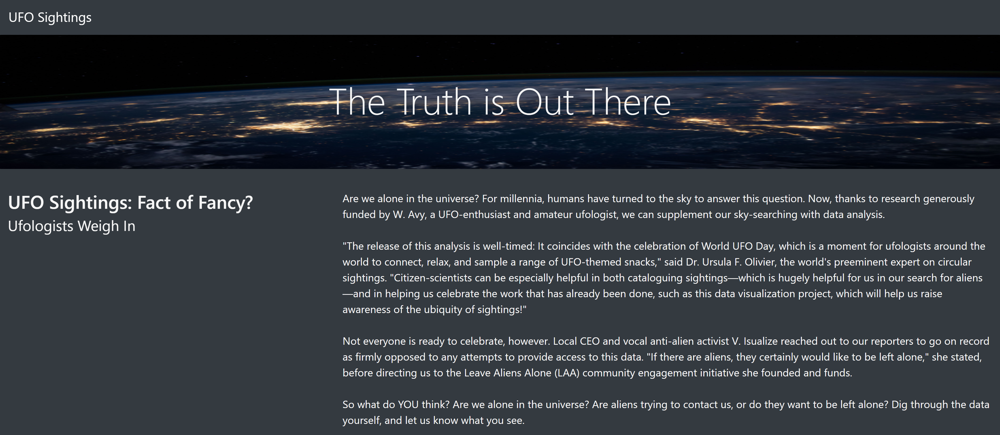
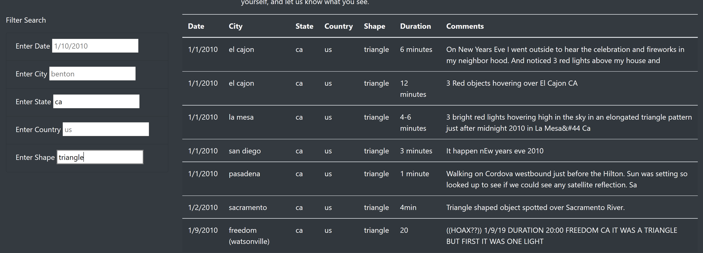

# UFOs
## Purpose
Dana's website that we created works perfectly. However, she would like to add more filters for a deeper analysis. Dana wants us to create table filters for the city, state, country, and shape.
## Results

\
There are several ways we can filter this data on the website to find out specific things. There are five variables we can filter. Here are just a few examples of what we can find when filtering each of the five variables. We can look at a specific date to find out where UFOs were sighted on that date or how many UFOs were sighted. We can look up a specific city to find how many UFOs were sighted in that city. Also, we can filter by state and see which city in the state have the most sightings. We can filter to country and see how many sightings were in the US. Lastly, we can filter the shape of the UFO and find out what shape is the most common. In the image above, I filtered to the State of California and the shape of the UFO to triangle.
## Summary
We were able to create a clean website that can filter UFO sightings data with five different variables. One of the drawbacks is not knowing the validity of the data. How many people actually saw the UFO? The more the people the more valid the sighting is. Therefore, it would have been nice to know how many people saw each UFO. There are ways we could improve this website further. One, we could have the website show the frequency of the UFOs based upon what filters someone used. For example, there were 15 UFOs in California on 1/1/2010. Another idea is to calculate the average duration time based upon what filters someone used. For example, the average duration of triangle UFOs in California was 10 minutes on 1/1/2010.
